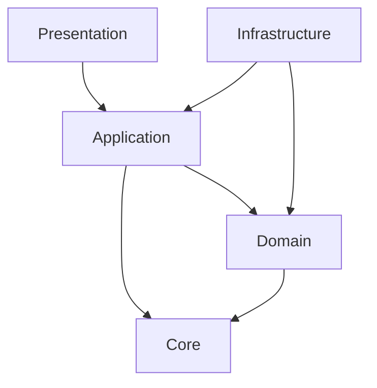
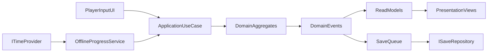

# Idle Pancake Architecture (Unity)

## 1. Scope
- Platform: mobile only (`Android`, `iOS`).
- Product stage: medium MVP.
- Includes: multiple recipes, upgrades, offline progress, prestige.
- Excludes: concrete gameplay implementation, SDK bindings, production content.

## 2. Architectural Style
- `Feature-first`: code grouped by business features.
- `Layered/Clean`: dependencies point inward.
- `UseCase` oriented application layer.
- Static game balance in `ScriptableObject` configs, runtime progress in save snapshots.

## 3. Layers and Dependency Rules

### Presentation
- UI screens, views, presenters/view-models.
- Converts user intent to application commands.
- Knows nothing about persistence, device SDKs, ad/IAP SDK APIs.

### Application
- Use cases orchestration and transaction boundaries.
- Validates command preconditions via domain services/entities.
- Publishes domain events for read model refresh and persistence queueing.

### Domain
- Pure business model.
- No Unity API references.
- Holds economy formulas, invariants, and progression rules.

### Infrastructure
- Save/load repository, clock provider, analytics adapters, ad/IAP adapters.
- Implements interfaces declared by inner layers.

## 4. Allowed Dependencies
- `Presentation` -> `Application`
- `Application` -> `Domain`
- `Application` -> `Core`
- `Infrastructure` -> `Application` (interface implementations only)
- `Infrastructure` -> `Domain` (serialization mapping and adapters only)
- `Domain` -> `Core`
- `Core` -> (none)

Forbidden:
- `Presentation` -> `Infrastructure`
- `Domain` -> `Infrastructure`
- `Domain` -> `Presentation`



## 5. Feature Modules
- `CoreLoop`: tick scheduler contract, production accumulation policies.
- `Economy`: currency operations, cost curves, multipliers, rounding policy.
- `Recipes`: unlock and progression of recipes/workstations.
- `Upgrades`: purchase and activation of upgrade effects.
- `OfflineProgress`: elapsed-time simulation and capped income processing.
- `Prestige`: reset strategy and meta currency grant policy.
- `SaveLoad`: snapshot persistence and migration pipeline.
- `Meta`: tutorial flags, achievement hooks, meta progression extension points.

## 6. Project Structure Blueprint
```text
Assets/
  Configs/
    Recipes/
    Upgrades/
    Economy/
  Scripts/
    Core/
      Abstractions/
      Events/
      Errors/
    Features/
      CoreLoop/
        Presentation/
        Application/
        Domain/
        Infrastructure/
      Economy/
      Recipes/
      Upgrades/
      OfflineProgress/
      Prestige/
      SaveLoad/
      Meta/
    Composition/
      GameBootstrap/
```

## 7. Core Contracts
- `ITimeProvider`: UTC now and elapsed calculations for deterministic tests.
- `ISaveRepository`: load/save snapshot with version metadata.
- `IEconomyFormulaService`: pure formula computation abstractions.
- `IAnalyticsService`: event tracking interface from application layer only.
- `IRandomService`: deterministic random source interface for future boosts/events.

## 8. Domain Events
- `IncomeAccumulated`
- `IncomeCollected`
- `UpgradePurchased`
- `RecipeUnlocked`
- `OfflineProgressApplied`
- `PrestigePerformed`

Events are emitted by use cases after successful state transitions and consumed by:
- read model updaters for UI,
- deferred save queue,
- analytics event mapper.

## 9. Main Data Flow


## 10. Quality Constraints
- Deterministic economy operations (`long`/fixed-point style amounts for currencies).
- No gameplay logic in MonoBehaviours except view wiring and lifecycle delegation.
- New recipe should be added through config + registration only, without core loop edits.
- All use cases should be unit testable without Unity runtime.
