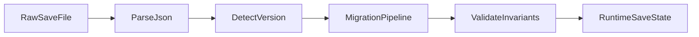

# Idle Pancake Save Format

## 1. Save Principles
- `Config` and `RuntimeState` are separated.
- Save file stores only runtime progress and technical metadata.
- All save schema changes are versioned and migrated.
- Save write is atomic (temp file + replace).

## 2. Save State Top-Level Schema
```json
{
  "version": 1,
  "profileId": "default",
  "lastSeenUtc": "2026-03-02T12:00:00Z",
  "createdUtc": "2026-03-01T09:30:00Z",
  "updatedUtc": "2026-03-02T12:00:00Z",
  "player": {
    "currencies": {
      "coins": 125000,
      "pancakeToken": 12
    },
    "lifetime": {
      "totalCoinsEarned": 1825000,
      "totalPrestiges": 2
    }
  },
  "kitchen": {
    "uncollectedCoins": 3500,
    "recipes": [
      {
        "recipeId": "classic_pancake",
        "isUnlocked": true,
        "level": 15
      },
      {
        "recipeId": "banana_pancake",
        "isUnlocked": true,
        "level": 5
      }
    ],
    "upgrades": [
      {
        "upgradeId": "faster_pan",
        "level": 3
      }
    ],
    "activeBoosts": []
  },
  "prestige": {
    "rank": 2,
    "metaUpgrades": [
      {
        "metaUpgradeId": "global_income_plus",
        "level": 1
      }
    ]
  },
  "meta": {
    "tutorialFlags": {
      "firstCollectDone": true,
      "firstUpgradeDone": true
    },
    "achievements": []
  }
}
```

## 3. Runtime vs Config Mapping
- Save stores identifiers only: `recipeId`, `upgradeId`, `metaUpgradeId`.
- Values like base costs, multipliers, unlock order are read from `ScriptableObject` configs.
- If config item is missing at load time:
  - ignore unknown save entry,
  - log migration warning,
  - keep remaining data valid.

## 4. Repositories and Contracts
- `ISaveRepository`
  - `SaveState Load()`
  - `void Save(SaveState snapshot)`
  - `bool Exists()`

- `ISaveMigrationPipeline`
  - `SaveState UpgradeToLatest(SaveState oldState)`

- `ISaveIntegrityService` (optional MVP+)
  - basic checksum validation.

## 5. Versioning Strategy
- Increment `version` on any backward-incompatible schema change.
- Migrations are linear and explicit:
  - `MigrateV1ToV2`
  - `MigrateV2ToV3`
- Loader pipeline:
  1. parse raw data,
  2. detect version,
  3. run migrations until latest,
  4. validate invariants,
  5. return runtime snapshot.



## 6. Invariants Validation
- Currency values cannot be negative.
- Recipe levels must be within configured limits.
- Unlocked recipe prerequisites must be satisfiable.
- `lastSeenUtc <= nowUtc + allowedClockSkew`.
- Duplicated IDs in recipes/upgrades collections are compacted by merge policy.

On invalid data:
- attempt auto-fix when safe,
- fallback to previous backup snapshot,
- final fallback to new clean state with telemetry flag.

## 7. Save Triggers
- Debounced periodic save (for example every 10-20 seconds if dirty).
- Immediate save on:
  - app pause/background,
  - prestige confirmation,
  - critical purchase completion.

## 8. Offline Progress Load Sequence
1. Load and migrate save.
2. Compute elapsed from `lastSeenUtc`.
3. Apply cap and efficiency in `ApplyOfflineProgressUseCase`.
4. Update balances/buffers.
5. Set `lastSeenUtc = nowUtc`.
6. Save updated snapshot.

## 9. Reset Policies
- Soft reset (prestige): preserve `prestige` and `meta`, reset run progress in `kitchen` and `coins`.
- Hard reset (settings action): wipe full snapshot and recreate initial state at latest version.

## 10. Storage Notes (Mobile)
- Single profile for MVP.
- Store in `persistentDataPath`.
- Keep one rolling backup copy:
  - `save.json`
  - `save.bak.json`
